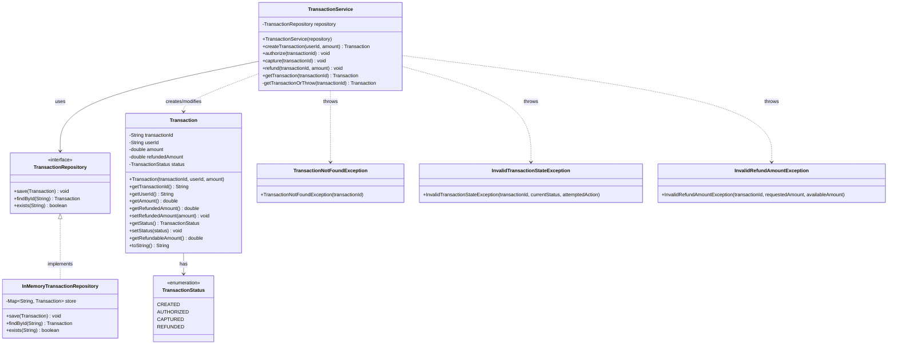
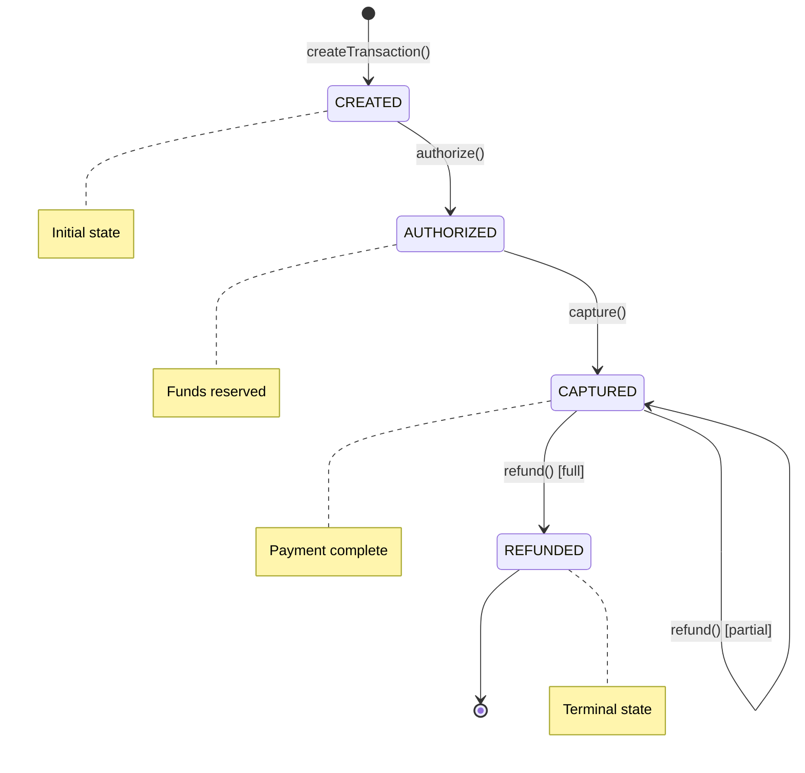
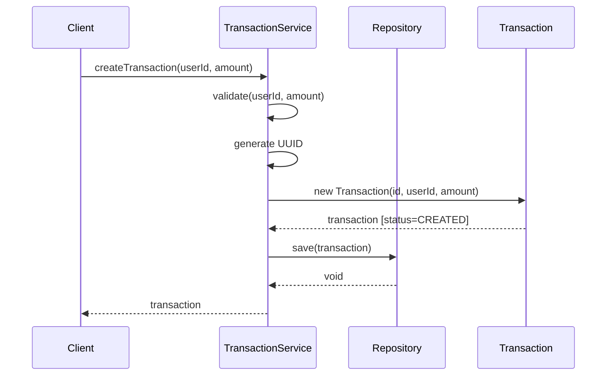
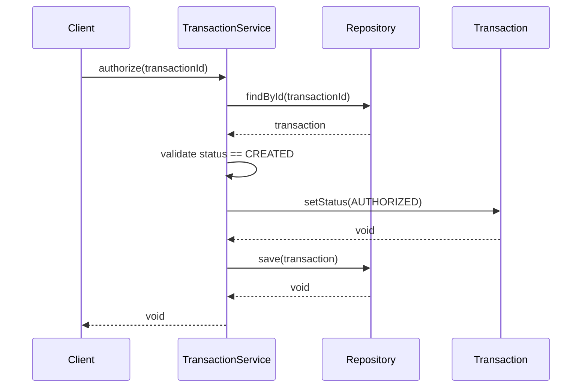

# Card Payment Transaction System - Low-Level Design (LLD)

A complete payment transaction management system demonstrating clean architecture, SOLID principles, and payment domain modeling.

---

## Table of Contents

1. [Problem Statement](#1-problem-statement)
2. [Requirements Analysis](#2-requirements-analysis)
3. [High-Level Design](#3-high-level-design)
4. [Class Diagram](#4-class-diagram)
5. [State Machine](#5-state-machine)
6. [Sequence Diagrams](#6-sequence-diagrams)
7. [API Specification](#7-api-specification)
8. [Error Handling](#8-error-handling)
9. [Code Walkthrough](#9-code-walkthrough)
10. [Design Decisions & Trade-offs](#10-design-decisions--trade-offs)
11. [Extension Points](#11-extension-points)
12. [Interview Preparation](#12-interview-preparation)

---

## 1. Problem Statement

Design and implement a **Payment Transaction System** that manages the complete lifecycle of payment transactions.

### Core Operations
- **Create** a new transaction
- **Authorize** a transaction (validate & reserve funds)
- **Capture** an authorized transaction (actually charge)
- **Refund** a captured transaction (partial or full)
- **Query** transaction details

---

## 2. Requirements Analysis

### 2.1 Functional Requirements

| ID | Requirement | Details |
|----|-------------|---------|
| FR1 | Create Transaction | Generate unique ID, store userId, amount |
| FR2 | Authorize | Transition from CREATED → AUTHORIZED |
| FR3 | Capture | Transition from AUTHORIZED → CAPTURED |
| FR4 | Refund | Partial/full refund, track refunded amount |
| FR5 | Get Details | Retrieve transaction by ID |

### 2.2 Non-Functional Requirements

| ID | Requirement | Implementation |
|----|-------------|----------------|
| NFR1 | In-memory storage | HashMap-based repository |
| NFR2 | Single-threaded | No synchronization needed |
| NFR3 | Clear error messages | Custom exceptions |
| NFR4 | Extensible design | Interface-based repository |

### 2.3 Business Rules

```
Rule 1: State transitions must follow: CREATED → AUTHORIZED → CAPTURED → REFUNDED
Rule 2: Invalid state transitions throw InvalidTransactionStateException
Rule 3: Total refunded amount ≤ original captured amount
Rule 4: Partial refunds keep status as CAPTURED until fully refunded
Rule 5: REFUNDED is a terminal state (no further operations allowed)
```

---

## 3. High-Level Design

### 3.1 Architecture Overview

```
┌─────────────────────────────────────────────────────────────────┐
│                        CLIENT / MAIN                            │
└─────────────────────────────────────────────────────────────────┘
                                │
                                ▼
┌─────────────────────────────────────────────────────────────────┐
│                    SERVICE LAYER                                │
│  ┌───────────────────────────────────────────────────────────┐  │
│  │                  TransactionService                       │  │
│  │  • createTransaction(userId, amount)                      │  │
│  │  • authorize(transactionId)                               │  │
│  │  • capture(transactionId)                                 │  │
│  │  • refund(transactionId, amount)                          │  │
│  │  • getTransaction(transactionId)                          │  │
│  └───────────────────────────────────────────────────────────┘  │
└─────────────────────────────────────────────────────────────────┘
                                │
                                ▼
┌─────────────────────────────────────────────────────────────────┐
│                   REPOSITORY LAYER                              │
│  ┌─────────────────────┐    ┌─────────────────────────────┐     │
│  │ <<interface>>       │    │ InMemoryTransactionRepository│    │
│  │ TransactionRepository│◄───│                             │    │
│  │  • save()           │    │  Map<String, Transaction>   │     │
│  │  • findById()       │    │                             │     │
│  │  • exists()         │    └─────────────────────────────┘     │
│  └─────────────────────┘                                        │
└─────────────────────────────────────────────────────────────────┘
                                │
                                ▼
┌─────────────────────────────────────────────────────────────────┐
│                      ENTITY LAYER                               │
│  ┌─────────────────────┐    ┌─────────────────────────────┐     │
│  │    Transaction      │    │   TransactionStatus (Enum)  │     │
│  │  • transactionId    │    │   • CREATED                 │     │
│  │  • userId           │    │   • AUTHORIZED              │     │
│  │  • amount           │    │   • CAPTURED                │     │
│  │  • refundedAmount   │    │   • REFUNDED                │     │
│  │  • status           │    └─────────────────────────────┘     │
│  └─────────────────────┘                                        │
└─────────────────────────────────────────────────────────────────┘
```

### 3.2 Package Structure

```
src/main/java/com/paypay/payment/
│
├── entity/                          # Domain models
│   ├── Transaction.java             # Core entity
│   └── TransactionStatus.java       # State enum
│
├── repository/                      # Data access layer
│   ├── TransactionRepository.java   # Interface (abstraction)
│   └── InMemoryTransactionRepository.java  # Implementation
│
├── service/                         # Business logic
│   └── TransactionService.java      # Main service
│
├── exception/                       # Custom exceptions
│   ├── TransactionNotFoundException.java
│   ├── InvalidTransactionStateException.java
│   └── InvalidRefundAmountException.java
│
└── Main.java                        # Demo & tests
```

---

## 4. Class Diagram



### 4.1 Class Diagram (ASCII Version)

```
┌──────────────────────────────────────────────────────────────────────────────┐
│                              CLASS DIAGRAM                                    │
└──────────────────────────────────────────────────────────────────────────────┘

    ┌─────────────────────┐
    │ <<enumeration>>     │
    │ TransactionStatus   │
    ├─────────────────────┤
    │ CREATED             │
    │ AUTHORIZED          │
    │ CAPTURED            │
    │ REFUNDED            │
    └─────────────────────┘
              ▲
              │ has
              │
    ┌─────────────────────────────────┐
    │         Transaction             │
    ├─────────────────────────────────┤
    │ - transactionId: String         │
    │ - userId: String                │
    │ - amount: double                │
    │ - refundedAmount: double        │
    │ - status: TransactionStatus     │
    ├─────────────────────────────────┤
    │ + getTransactionId(): String    │
    │ + getUserId(): String           │
    │ + getAmount(): double           │
    │ + getRefundedAmount(): double   │
    │ + setRefundedAmount(double)     │
    │ + getStatus(): TransactionStatus│
    │ + setStatus(TransactionStatus)  │
    │ + getRefundableAmount(): double │
    └─────────────────────────────────┘
              ▲
              │ creates/modifies
              │
    ┌─────────────────────────────────────────┐
    │          TransactionService             │
    ├─────────────────────────────────────────┤
    │ - repository: TransactionRepository     │
    ├─────────────────────────────────────────┤
    │ + createTransaction(userId, amount)     │
    │ + authorize(transactionId)              │
    │ + capture(transactionId)                │
    │ + refund(transactionId, amount)         │
    │ + getTransaction(transactionId)         │
    │ - getTransactionOrThrow(transactionId)  │
    └─────────────────────────────────────────┘
              │
              │ uses
              ▼
    ┌─────────────────────────────────┐
    │     <<interface>>               │
    │   TransactionRepository         │
    ├─────────────────────────────────┤
    │ + save(Transaction): void       │
    │ + findById(String): Transaction │
    │ + exists(String): boolean       │
    └─────────────────────────────────┘
              ▲
              │ implements
              │
    ┌─────────────────────────────────┐
    │ InMemoryTransactionRepository   │
    ├─────────────────────────────────┤
    │ - store: Map<String,Transaction>│
    ├─────────────────────────────────┤
    │ + save(Transaction): void       │
    │ + findById(String): Transaction │
    │ + exists(String): boolean       │
    └─────────────────────────────────┘


    ┌─────────────────────────────────────────────────────────────────┐
    │                      EXCEPTIONS                                  │
    ├─────────────────────────────────────────────────────────────────┤
    │                                                                  │
    │  ┌───────────────────────────┐  ┌────────────────────────────┐  │
    │  │TransactionNotFoundException│  │InvalidTransactionState    │  │
    │  │                           │  │        Exception           │  │
    │  │ + (transactionId)         │  │                            │  │
    │  └───────────────────────────┘  │ + (transactionId,          │  │
    │                                  │    currentStatus,          │  │
    │  ┌───────────────────────────┐  │    attemptedAction)        │  │
    │  │InvalidRefundAmount        │  └────────────────────────────┘  │
    │  │        Exception          │                                  │
    │  │                           │                                  │
    │  │ + (transactionId,         │                                  │
    │  │    requestedAmount,       │                                  │
    │  │    availableAmount)       │                                  │
    │  └───────────────────────────┘                                  │
    │                                                                  │
    └─────────────────────────────────────────────────────────────────┘
```

---

## 5. State Machine

### 5.1 State Transition Diagram



### 5.2 State Transition Diagram (ASCII)

```
┌──────────────────────────────────────────────────────────────────────────────┐
│                         STATE TRANSITION DIAGRAM                              │
└──────────────────────────────────────────────────────────────────────────────┘

                        createTransaction()
                               │
                               ▼
                    ┌─────────────────────┐
                    │                     │
                    │       CREATED       │ ◄─── Initial State
                    │                     │      (Transaction initialized)
                    └──────────┬──────────┘
                               │
                               │ authorize()
                               │
                               ▼
                    ┌─────────────────────┐
                    │                     │
                    │     AUTHORIZED      │ ◄─── Funds Reserved
                    │                     │      (Ready to capture)
                    └──────────┬──────────┘
                               │
                               │ capture()
                               │
                               ▼
                    ┌─────────────────────┐
         ┌────────►│                     │
         │         │      CAPTURED       │ ◄─── Payment Complete
         │         │                     │      (Funds transferred)
         │         └──────────┬──────────┘
         │                    │
         │ refund()           │ refund()
         │ (partial)          │ (full - when refundedAmount == amount)
         │                    │
         └────────────────────┼───────────────────────┐
                              │                       │
                              ▼                       │
                    ┌─────────────────────┐           │
                    │                     │           │
                    │      REFUNDED       │ ◄─────────┘
                    │                     │      Terminal State
                    └─────────────────────┘      (No further operations)


┌──────────────────────────────────────────────────────────────────────────────┐
│                         STATE TRANSITION TABLE                                │
├──────────────────┬───────────────────────────────────────────────────────────┤
│  Current State   │  Allowed Operations → Next State                          │
├──────────────────┼───────────────────────────────────────────────────────────┤
│  CREATED         │  authorize() → AUTHORIZED                                 │
│  AUTHORIZED      │  capture() → CAPTURED                                     │
│  CAPTURED        │  refund(partial) → CAPTURED                               │
│                  │  refund(full) → REFUNDED                                  │
│  REFUNDED        │  (none - terminal state)                                  │
└──────────────────┴───────────────────────────────────────────────────────────┘
```

### 5.3 Invalid Transitions (Throw Exception)

```
┌──────────────────────────────────────────────────────────────────────────────┐
│                        INVALID STATE TRANSITIONS                              │
├──────────────────┬───────────────────────────────────────────────────────────┤
│  Operation       │  Invalid From States                                       │
├──────────────────┼───────────────────────────────────────────────────────────┤
│  authorize()     │  AUTHORIZED, CAPTURED, REFUNDED                           │
│  capture()       │  CREATED, CAPTURED, REFUNDED                              │
│  refund()        │  CREATED, AUTHORIZED, REFUNDED                            │
└──────────────────┴───────────────────────────────────────────────────────────┘
```

---

## 6. Sequence Diagrams

### 6.1 Create Transaction



#### ASCII Version:

```
┌──────────────────────────────────────────────────────────────────────────────┐
│                    SEQUENCE: CREATE TRANSACTION                               │
└──────────────────────────────────────────────────────────────────────────────┘

  Client              TransactionService         Repository          Transaction
    │                        │                       │                    │
    │ createTransaction()    │                       │                    │
    │ (userId, amount)       │                       │                    │
    │───────────────────────>│                       │                    │
    │                        │                       │                    │
    │                        │ validate inputs       │                    │
    │                        │────────┐              │                    │
    │                        │        │              │                    │
    │                        │<───────┘              │                    │
    │                        │                       │                    │
    │                        │ generate UUID         │                    │
    │                        │────────┐              │                    │
    │                        │        │              │                    │
    │                        │<───────┘              │                    │
    │                        │                       │                    │
    │                        │ new Transaction(id, userId, amount)        │
    │                        │───────────────────────────────────────────>│
    │                        │                       │                    │
    │                        │                       │   [status=CREATED] │
    │                        │<───────────────────────────────────────────│
    │                        │                       │                    │
    │                        │ save(transaction)     │                    │
    │                        │──────────────────────>│                    │
    │                        │                       │                    │
    │                        │        void           │                    │
    │                        │<──────────────────────│                    │
    │                        │                       │                    │
    │      transaction       │                       │                    │
    │<───────────────────────│                       │                    │
    │                        │                       │                    │
```

### 6.2 Authorize Transaction



#### ASCII Version:

```
┌──────────────────────────────────────────────────────────────────────────────┐
│                    SEQUENCE: AUTHORIZE TRANSACTION                            │
└──────────────────────────────────────────────────────────────────────────────┘

  Client              TransactionService         Repository          Transaction
    │                        │                       │                    │
    │ authorize(txnId)       │                       │                    │
    │───────────────────────>│                       │                    │
    │                        │                       │                    │
    │                        │ findById(txnId)       │                    │
    │                        │──────────────────────>│                    │
    │                        │                       │                    │
    │                        │      transaction      │                    │
    │                        │<──────────────────────│                    │
    │                        │                       │                    │
    │                        │ validate status       │                    │
    │                        │ == CREATED            │                    │
    │                        │────────┐              │                    │
    │                        │        │              │                    │
    │                        │<───────┘              │                    │
    │                        │                       │                    │
    │                        │ setStatus(AUTHORIZED) │                    │
    │                        │───────────────────────────────────────────>│
    │                        │                       │                    │
    │                        │<───────────────────────────────────────────│
    │                        │                       │                    │
    │                        │ save(transaction)     │                    │
    │                        │──────────────────────>│                    │
    │                        │                       │                    │
    │                        │<──────────────────────│                    │
    │                        │                       │                    │
    │         void           │                       │                    │
    │<───────────────────────│                       │                    │
    │                        │                       │                    │
```

### 6.3 Capture Transaction

```
┌──────────────────────────────────────────────────────────────────────────────┐
│                    SEQUENCE: CAPTURE TRANSACTION                              │
└──────────────────────────────────────────────────────────────────────────────┘

  Client              TransactionService         Repository          Transaction
    │                        │                       │                    │
    │ capture(txnId)         │                       │                    │
    │───────────────────────>│                       │                    │
    │                        │                       │                    │
    │                        │ findById(txnId)       │                    │
    │                        │──────────────────────>│                    │
    │                        │                       │                    │
    │                        │      transaction      │                    │
    │                        │<──────────────────────│                    │
    │                        │                       │                    │
    │                        │ validate status       │                    │
    │                        │ == AUTHORIZED         │                    │
    │                        │────────┐              │                    │
    │                        │        │              │                    │
    │                        │<───────┘              │                    │
    │                        │                       │                    │
    │                        │ setStatus(CAPTURED)   │                    │
    │                        │───────────────────────────────────────────>│
    │                        │                       │                    │
    │                        │<───────────────────────────────────────────│
    │                        │                       │                    │
    │                        │ save(transaction)     │                    │
    │                        │──────────────────────>│                    │
    │                        │                       │                    │
    │         void           │                       │                    │
    │<───────────────────────│                       │                    │
    │                        │                       │                    │
```

### 6.4 Refund Transaction (Partial)

```
┌──────────────────────────────────────────────────────────────────────────────┐
│                    SEQUENCE: REFUND TRANSACTION (PARTIAL)                     │
└──────────────────────────────────────────────────────────────────────────────┘

  Client              TransactionService         Repository          Transaction
    │                        │                       │                    │
    │ refund(txnId, 50.0)    │                       │                    │
    │───────────────────────>│                       │                    │
    │                        │                       │                    │
    │                        │ validate amount > 0   │                    │
    │                        │────────┐              │                    │
    │                        │<───────┘              │                    │
    │                        │                       │                    │
    │                        │ findById(txnId)       │                    │
    │                        │──────────────────────>│                    │
    │                        │      transaction      │                    │
    │                        │<──────────────────────│                    │
    │                        │                       │                    │
    │                        │ validate status       │                    │
    │                        │ == CAPTURED           │                    │
    │                        │────────┐              │                    │
    │                        │<───────┘              │                    │
    │                        │                       │                    │
    │                        │ getRefundableAmount() │                    │
    │                        │───────────────────────────────────────────>│
    │                        │      100.0            │                    │
    │                        │<───────────────────────────────────────────│
    │                        │                       │                    │
    │                        │ validate 50 <= 100    │                    │
    │                        │────────┐              │                    │
    │                        │<───────┘              │                    │
    │                        │                       │                    │
    │                        │ setRefundedAmount(50) │                    │
    │                        │───────────────────────────────────────────>│
    │                        │<───────────────────────────────────────────│
    │                        │                       │                    │
    │                        │ (50 < 100, stay CAPTURED)                  │
    │                        │                       │                    │
    │                        │ save(transaction)     │                    │
    │                        │──────────────────────>│                    │
    │                        │                       │                    │
    │         void           │                       │                    │
    │<───────────────────────│                       │                    │
    │                        │                       │                    │
```

### 6.5 Refund Transaction (Full)

```
┌──────────────────────────────────────────────────────────────────────────────┐
│                    SEQUENCE: REFUND TRANSACTION (FULL)                        │
└──────────────────────────────────────────────────────────────────────────────┘

  Client              TransactionService         Repository          Transaction
    │                        │                       │                    │
    │ refund(txnId, 100.0)   │                       │                    │
    │───────────────────────>│                       │                    │
    │                        │                       │                    │
    │                        │ [... same validation as partial ...]       │
    │                        │                       │                    │
    │                        │ setRefundedAmount(100)│                    │
    │                        │───────────────────────────────────────────>│
    │                        │<───────────────────────────────────────────│
    │                        │                       │                    │
    │                        │ (100 >= 100, transition to REFUNDED)       │
    │                        │                       │                    │
    │                        │ setStatus(REFUNDED)   │                    │
    │                        │───────────────────────────────────────────>│
    │                        │<───────────────────────────────────────────│
    │                        │                       │                    │
    │                        │ save(transaction)     │                    │
    │                        │──────────────────────>│                    │
    │                        │                       │                    │
    │         void           │                       │                    │
    │<───────────────────────│                       │                    │
    │                        │                       │                    │
```

### 6.6 Error Flow - Invalid State Transition

```
┌──────────────────────────────────────────────────────────────────────────────┐
│                    SEQUENCE: ERROR - INVALID STATE TRANSITION                 │
└──────────────────────────────────────────────────────────────────────────────┘

  Client              TransactionService         Repository          Transaction
    │                        │                       │                    │
    │ capture(txnId)         │                       │                    │
    │───────────────────────>│                       │                    │
    │                        │                       │                    │
    │                        │ findById(txnId)       │                    │
    │                        │──────────────────────>│                    │
    │                        │                       │                    │
    │                        │ transaction           │                    │
    │                        │ [status=CREATED]      │                    │
    │                        │<──────────────────────│                    │
    │                        │                       │                    │
    │                        │ validate status       │                    │
    │                        │ == AUTHORIZED         │                    │
    │                        │────────┐              │                    │
    │                        │  FAIL! │              │                    │
    │                        │<───────┘              │                    │
    │                        │                       │                    │
    │ InvalidTransactionStateException               │                    │
    │ "Cannot capture txn in status CREATED"         │                    │
    │<───────────────────────│                       │                    │
    │                        │                       │                    │
```

---

## 7. API Specification

### 7.1 TransactionService API

```java
public class TransactionService {

    /**
     * Creates a new transaction.
     *
     * @param userId  The user initiating the transaction (required)
     * @param amount  The transaction amount (must be positive)
     * @return        The created Transaction with status CREATED
     * @throws IllegalArgumentException if userId is null/empty or amount <= 0
     */
    public Transaction createTransaction(String userId, double amount);

    /**
     * Authorizes a transaction (reserves funds).
     *
     * @param transactionId  The transaction to authorize
     * @throws TransactionNotFoundException if transaction doesn't exist
     * @throws InvalidTransactionStateException if not in CREATED status
     */
    public void authorize(String transactionId);

    /**
     * Captures an authorized transaction (charges the user).
     *
     * @param transactionId  The transaction to capture
     * @throws TransactionNotFoundException if transaction doesn't exist
     * @throws InvalidTransactionStateException if not in AUTHORIZED status
     */
    public void capture(String transactionId);

    /**
     * Refunds a captured transaction (partial or full).
     *
     * @param transactionId  The transaction to refund
     * @param amount         The amount to refund (must be positive)
     * @throws IllegalArgumentException if amount <= 0
     * @throws TransactionNotFoundException if transaction doesn't exist
     * @throws InvalidTransactionStateException if not in CAPTURED status
     * @throws InvalidRefundAmountException if amount > available refundable amount
     */
    public void refund(String transactionId, double amount);

    /**
     * Retrieves transaction details.
     *
     * @param transactionId  The transaction ID to look up
     * @return               The Transaction
     * @throws TransactionNotFoundException if transaction doesn't exist
     */
    public Transaction getTransaction(String transactionId);
}
```

### 7.2 Method Summary Table

| Method | Input | Output | Exceptions |
|--------|-------|--------|------------|
| `createTransaction` | userId, amount | Transaction | IllegalArgumentException |
| `authorize` | transactionId | void | TransactionNotFoundException, InvalidTransactionStateException |
| `capture` | transactionId | void | TransactionNotFoundException, InvalidTransactionStateException |
| `refund` | transactionId, amount | void | TransactionNotFoundException, InvalidTransactionStateException, InvalidRefundAmountException, IllegalArgumentException |
| `getTransaction` | transactionId | Transaction | TransactionNotFoundException |

---

## 8. Error Handling

### 8.1 Exception Hierarchy

```
RuntimeException
    │
    ├── TransactionNotFoundException
    │       └── "Transaction not found: {transactionId}"
    │
    ├── InvalidTransactionStateException
    │       └── "Cannot {action} transaction {id} in status {status}"
    │
    ├── InvalidRefundAmountException
    │       └── "Cannot refund {amount} for transaction {id}. Available: {available}"
    │
    └── IllegalArgumentException (built-in)
            └── "userId cannot be null or empty"
            └── "amount must be positive"
            └── "refund amount must be positive"
```

### 8.2 Error Scenarios

| Scenario | Exception | Message |
|----------|-----------|---------|
| Transaction not found | TransactionNotFoundException | "Transaction not found: abc-123" |
| Authorize non-CREATED | InvalidTransactionStateException | "Cannot authorize transaction abc-123 in status AUTHORIZED" |
| Capture non-AUTHORIZED | InvalidTransactionStateException | "Cannot capture transaction abc-123 in status CREATED" |
| Refund non-CAPTURED | InvalidTransactionStateException | "Cannot refund transaction abc-123 in status AUTHORIZED" |
| Refund exceeds available | InvalidRefundAmountException | "Cannot refund 100.0 for transaction abc-123. Available for refund: 50.0" |
| Invalid userId | IllegalArgumentException | "userId cannot be null or empty" |
| Invalid amount | IllegalArgumentException | "amount must be positive" |

---

## 9. Code Walkthrough

### 9.1 TransactionStatus Enum

```java
// Location: entity/TransactionStatus.java

public enum TransactionStatus {
    CREATED,      // Initial state - transaction just created
    AUTHORIZED,   // Funds reserved with payment provider
    CAPTURED,     // Funds actually transferred
    REFUNDED      // Terminal state - fully refunded
}
```

**Why enum?**
- Type-safe (compiler prevents invalid states)
- Self-documenting
- Easy to extend with new states

### 9.2 Transaction Entity

```java
// Location: entity/Transaction.java

public class Transaction {
    private final String transactionId;   // Immutable - never changes
    private final String userId;          // Immutable - never changes
    private final double amount;          // Immutable - original amount
    private double refundedAmount;        // Mutable - tracks refunds
    private TransactionStatus status;     // Mutable - lifecycle state

    // Key method: calculates how much can still be refunded
    public double getRefundableAmount() {
        return amount - refundedAmount;
    }
}
```

**Design decisions:**
- `transactionId`, `userId`, `amount` are `final` (immutable)
- `refundedAmount` and `status` are mutable (change during lifecycle)
- `getRefundableAmount()` encapsulates refund calculation logic

### 9.3 Repository Pattern

```java
// Location: repository/TransactionRepository.java

public interface TransactionRepository {
    void save(Transaction transaction);
    Transaction findById(String transactionId);
    boolean exists(String transactionId);
}
```

**Why interface?**
- Decouples service from storage implementation
- Easy to swap: InMemory → Database → Redis
- Testable: can mock repository in unit tests

### 9.4 Service Layer

```java
// Location: service/TransactionService.java

public class TransactionService {
    private final TransactionRepository repository;

    // Constructor injection - dependency inversion
    public TransactionService(TransactionRepository repository) {
        this.repository = repository;
    }

    // Each method follows pattern:
    // 1. Validate input
    // 2. Fetch transaction (if needed)
    // 3. Validate state
    // 4. Perform operation
    // 5. Save changes
}
```

**Key patterns:**
- Constructor injection (DI)
- Private helper method `getTransactionOrThrow()`
- Clear validation before mutation

---

## 10. Design Decisions & Trade-offs

### 10.1 Decisions Made

| Decision | Rationale | Alternative Considered |
|----------|-----------|----------------------|
| `double` for amount | Simpler for demo | `BigDecimal` for production (precision) |
| UUID for transactionId | Guaranteed uniqueness | Auto-increment (needs DB) |
| RuntimeException subclasses | Cleaner API (unchecked) | Checked exceptions |
| State in Transaction entity | Simple, entity owns its state | Separate state machine class |
| REFUNDED only on full refund | Partial refunds stay CAPTURED | Separate PARTIALLY_REFUNDED state |

### 10.2 Trade-offs

```
┌─────────────────────────────────────────────────────────────────────────────┐
│                              TRADE-OFFS                                      │
├────────────────────┬─────────────────────────┬──────────────────────────────┤
│ Aspect             │ Current Choice          │ Trade-off                    │
├────────────────────┼─────────────────────────┼──────────────────────────────┤
│ Amount precision   │ double                  │ Simple but floating-point    │
│                    │                         │ errors possible              │
├────────────────────┼─────────────────────────┼──────────────────────────────┤
│ Thread safety      │ Not thread-safe         │ Simple but single-threaded   │
│                    │                         │ only                         │
├────────────────────┼─────────────────────────┼──────────────────────────────┤
│ State machine      │ In service layer        │ Flexible but state logic     │
│                    │                         │ spread across methods        │
├────────────────────┼─────────────────────────┼──────────────────────────────┤
│ Repository save    │ Always save after       │ Simple but extra writes      │
│                    │ mutation                │ even if unchanged            │
└────────────────────┴─────────────────────────┴──────────────────────────────┘
```

---

## 11. Extension Points

### 11.1 How to Add New Features

#### Add New State (e.g., VOIDED)

```java
// 1. Add to enum
enum TransactionStatus {
    CREATED, AUTHORIZED, CAPTURED, REFUNDED, VOIDED  // <-- add here
}

// 2. Add method to service
public void voidTransaction(String transactionId) {
    Transaction transaction = getTransactionOrThrow(transactionId);

    // Can void from CREATED or AUTHORIZED
    if (transaction.getStatus() != TransactionStatus.CREATED &&
        transaction.getStatus() != TransactionStatus.AUTHORIZED) {
        throw new InvalidTransactionStateException(
            transactionId, transaction.getStatus(), "void");
    }

    transaction.setStatus(TransactionStatus.VOIDED);
    repository.save(transaction);
}
```

#### Add Database Repository

```java
// Just implement the interface
public class JdbcTransactionRepository implements TransactionRepository {

    private final DataSource dataSource;

    @Override
    public void save(Transaction transaction) {
        // INSERT or UPDATE using JDBC
    }

    @Override
    public Transaction findById(String transactionId) {
        // SELECT from database
    }
}

// Usage - just swap implementation
TransactionRepository repository = new JdbcTransactionRepository(dataSource);
TransactionService service = new TransactionService(repository);
```

#### Add Concurrency Support

```java
public class ConcurrentTransactionService {
    private final ConcurrentHashMap<String, ReentrantLock> locks = new ConcurrentHashMap<>();

    public void authorize(String transactionId) {
        ReentrantLock lock = locks.computeIfAbsent(transactionId, k -> new ReentrantLock());
        lock.lock();
        try {
            // existing authorize logic
        } finally {
            lock.unlock();
        }
    }
}
```

### 11.2 Future Enhancements

```
┌─────────────────────────────────────────────────────────────────────────────┐
│                         FUTURE ENHANCEMENTS                                  │
├────────────────────────────────────────────────────────────────────────────┤
│ 1. Event Sourcing    - Store all state changes as events                    │
│ 2. Audit Trail       - Log who/when/what for each operation                │
│ 3. Idempotency Keys  - Prevent duplicate operations                         │
│ 4. Expiration        - Auto-void authorized transactions after timeout      │
│ 5. Currency Support  - Add currency field and conversion                    │
│ 6. Multiple Captures - Support partial capture of authorized amount        │
│ 7. Webhooks          - Notify external systems on state changes            │
└─────────────────────────────────────────────────────────────────────────────┘
```

---

## 12. Interview Preparation

### 12.1 Clarifying Questions to Ask

Before coding, ask the interviewer:

```
1. "Should partial refunds be allowed?" → Yes
2. "Can there be multiple partial refunds?" → Yes
3. "Is REFUNDED a terminal state, or can we continue partial refunds?" → Terminal
4. "Should I use BigDecimal for amounts in production?" → Mention you would
5. "Do I need to handle concurrency?" → Usually no for LLD
6. "Should I implement idempotency?" → Ask, usually not required
```

### 12.2 How to Explain Your Design

Use this script:

> "I've separated the design into three layers:
>
> **Entity layer** holds the Transaction and its status enum. The transaction is mostly immutable - only status and refunded amount change during its lifecycle.
>
> **Repository layer** is an interface that the service depends on. This follows dependency inversion - the service doesn't know about HashMap. Tomorrow we could swap in a database implementation without changing the service.
>
> **Service layer** contains all business logic - state validations, transitions, and refund calculations. Each method follows the same pattern: validate, fetch, check state, mutate, save.
>
> I've also created custom exceptions with meaningful messages - this makes debugging much easier in production."

### 12.3 Common Follow-up Questions

| Question | Good Answer |
|----------|-------------|
| "Why not put state logic in Transaction?" | "Could work, but service layer gives us one place for all business rules. Easier to test and modify." |
| "How would you handle concurrent requests?" | "Add locking per transactionId. Could use ConcurrentHashMap with ReentrantLock, or optimistic locking with version field in DB." |
| "What about double for money?" | "For demo, double is fine. Production should use BigDecimal to avoid floating-point precision errors." |
| "How would you add audit logging?" | "Add an AuditService, call it from TransactionService before each state change. Or use event sourcing." |
| "How would you test this?" | "Unit tests for service with mocked repository. Integration tests with real InMemoryRepository. Test all valid transitions and all invalid transitions." |

### 12.4 Time Management

```
┌─────────────────────────────────────────────────────────────────────────────┐
│                    85-MINUTE INTERVIEW TIMELINE                              │
├──────────────┬──────────────────────────────────────────────────────────────┤
│ 0-10 min     │ Read requirements, ask clarifying questions                  │
├──────────────┼──────────────────────────────────────────────────────────────┤
│ 10-20 min    │ Explain high-level design, draw state diagram                │
├──────────────┼──────────────────────────────────────────────────────────────┤
│ 20-35 min    │ Code enum + entity + repository interface                    │
├──────────────┼──────────────────────────────────────────────────────────────┤
│ 35-65 min    │ Code TransactionService (main focus!)                        │
├──────────────┼──────────────────────────────────────────────────────────────┤
│ 65-75 min    │ Add custom exceptions, validate edge cases                   │
├──────────────┼──────────────────────────────────────────────────────────────┤
│ 75-85 min    │ Test/walkthrough, discuss extensions                         │
└──────────────┴──────────────────────────────────────────────────────────────┘
```

### 12.5 Red Flags to Avoid

```
❌ One giant class with everything
❌ No enums - using strings for status
❌ No input validation
❌ Unclear exception messages
❌ Over-engineering (10 design patterns)
❌ Not explaining as you code
❌ Rushing without clarifying requirements

✅ Clean separation of concerns
✅ Type-safe enums
✅ Clear, specific exceptions
✅ Simple, readable code
✅ Explaining decisions as you code
✅ Asking questions upfront
```

---

## Quick Start

### Compile

```bash
javac -d out src/main/java/com/paypay/payment/**/*.java src/main/java/com/paypay/payment/Main.java
```

### Run

```bash
java -cp out com.paypay.payment.Main
```

### Expected Output

```
=== Payment Transaction System Demo ===

--- Test 1: Happy Path (Full Lifecycle) ---
Created: Transaction{transactionId='...', userId='user-123', amount=100.0, refundedAmount=0.0, status=CREATED}
Authorized: Transaction{...status=AUTHORIZED}
Captured: Transaction{...status=CAPTURED}
Refunded: Transaction{...refundedAmount=100.0, status=REFUNDED}

--- Test 2: Partial Refunds ---
...
=== All Tests Completed Successfully! ===
```

---

## Summary

This Payment Transaction System demonstrates:

1. **Clean Architecture** - Layered design with clear responsibilities
2. **SOLID Principles** - Single responsibility, dependency inversion
3. **State Machine** - Well-defined state transitions with validation
4. **Error Handling** - Custom exceptions with meaningful messages
5. **Extensibility** - Easy to add new states, storage, or features

Good luck with your interview!
